# Distribution

Distribution type system.

## Letter Sample

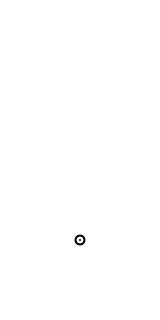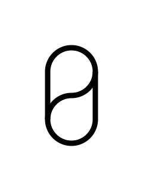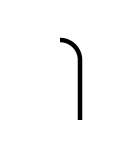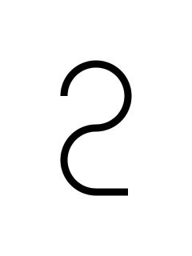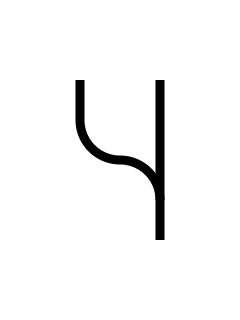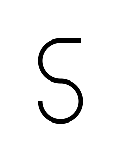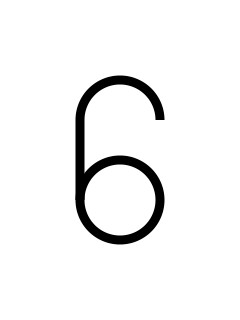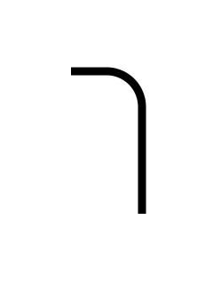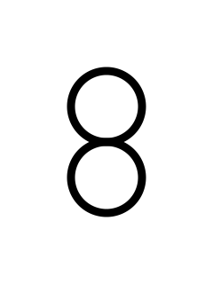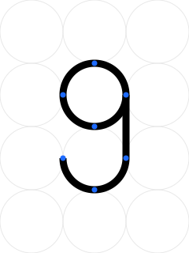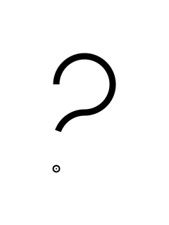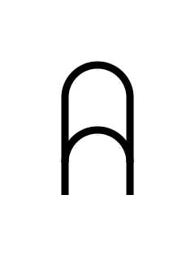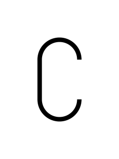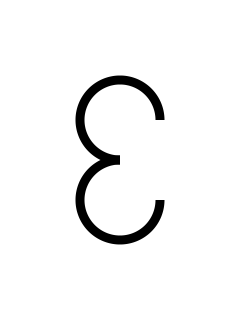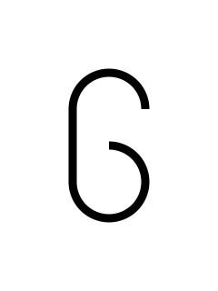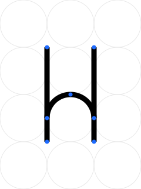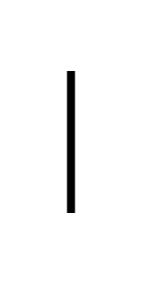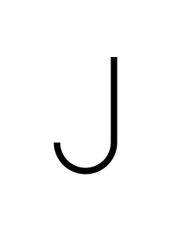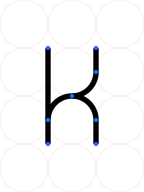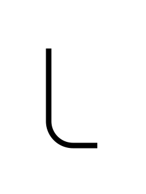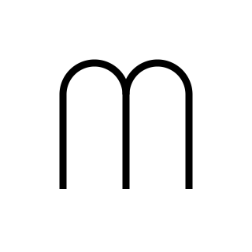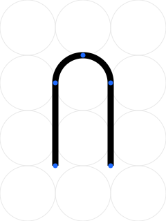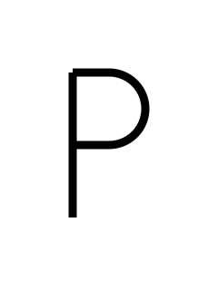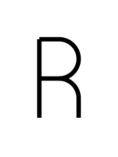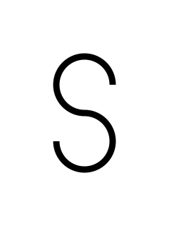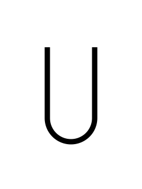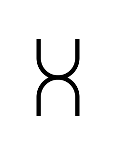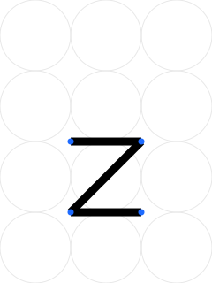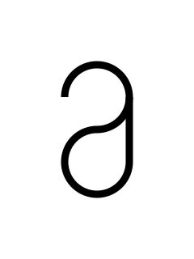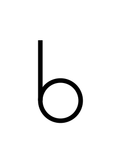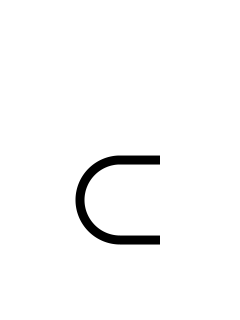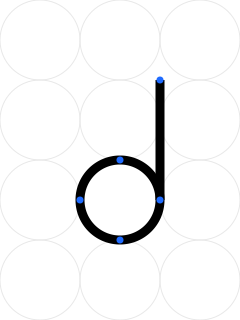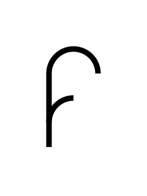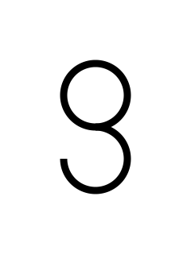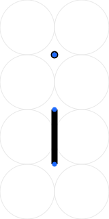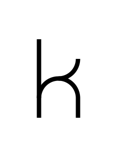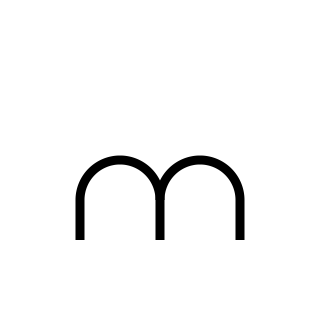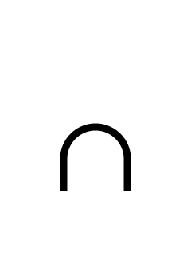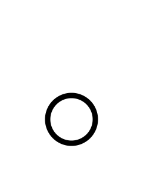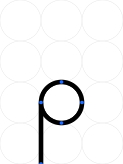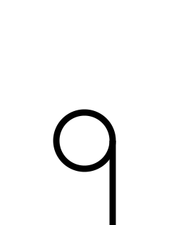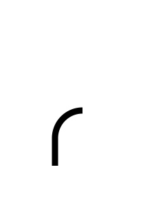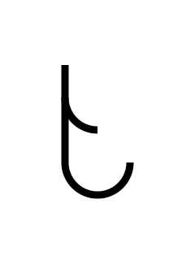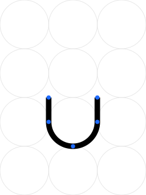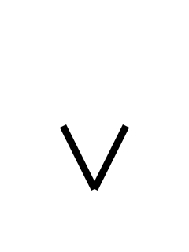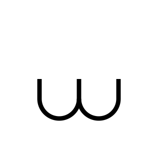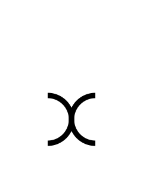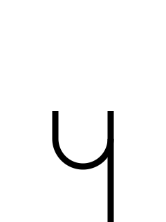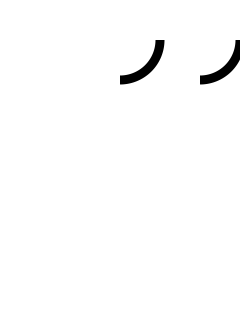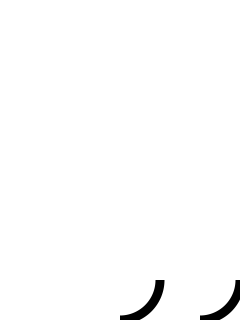

## Usage

```css
@font-face {
  font-family: "Distribution";
  font-style: normal;
  font-weight: 400;
  font-display: swap;
  src:
    url("https://hetcdn.nl/fonts/distribution.woff2") format("woff2"),
    url("https://hetcdn.nl/fonts/distribution.woff") format("woff"),
    url("https://hetcdn.nl/fonts/distribution.ttf") format("truetype");
}

:root {
    --font--distribution: "Distribution", system-ui, -apple-system, "Segoe UI", Roboto, Arial, sans-serif;
}

.font--distribution {
  font-family: var(--font--distribution);
  font-weight: 400;
  font-style: normal;
}
```
